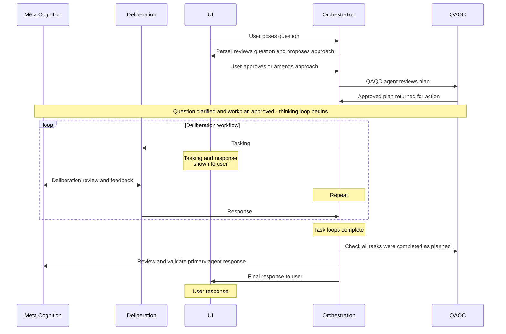

# Thinking Agent Framework

```mermaid
sequenceDiagram
    participant validate as Meta Cognition
    participant think as Deliberation
    participant ui as UI
    participant manage as Orchestration
    participant qaqc as QAQC

    ui->>manage: User poses question
    manage->>ui: Parser reviews question and proposes approach
    ui->>manage: User approves or amends approach
    manage->>qaqc: QAQC agent reviews plan
    qaqc->>manage: Approved plan returned for action
    Note over validate,qaqc: Question clarified and workplan approved - thinking loop begins
    loop Deliberation workflow
      manage->>think: Tasking
      Note over ui: Tasking and response<br/>shown to user
      think<<->>validate: Deliberation review and feedback
      Note over manage: Repeat
      think->>manage: Response
    end
    Note over manage: Task loops complete
    manage->>qaqc: Check all tasks were completed as planned
    manage->>validate: Review and validate primary agent response
    manage->>ui: Final response to user
    note over ui: User response

```
